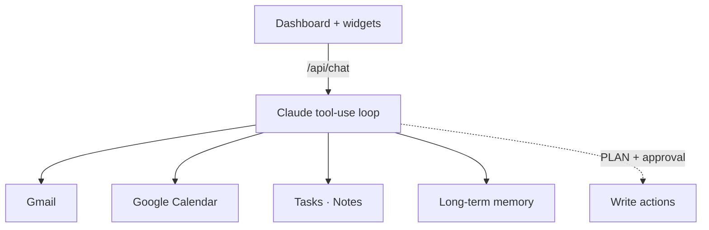

# Spidey 🕷️

**A personal AI "Chief of Staff" dashboard** — Claude runs a tool-use loop over your Gmail, Calendar, tasks, notes, and memory, with every write action gated behind an explicit approval step.

Built with Next.js 14, the Anthropic SDK, Google OAuth, and ElevenLabs voice.

---

## What it is

Spidey is a single-user command center for getting things done. You talk to it in a chat panel (or by voice); it reads your inbox and calendar, manages a task list and notes, remembers facts about you across sessions, and writes you a sharp morning brief. Crucially, **before it ever sends an email or creates a calendar event it writes a `##PLAN##` block and waits for your "good to go"** — no silent write actions.

The dashboard surrounds the chat with live widgets: inbox, calendar, tasks, notes, a focus timer, the daily brief, and long-term memory.

---

## Architecture at a glance



## Features

- **Claude tool-use loop** — the assistant calls real tools (`list_emails`, `send_email`, `list_events`, `create_calendar_event`, `add_task`, `read_notes`, `save_memory`, `get_morning_brief`, …) and reports results honestly, surfacing auth/tool errors instead of faking success
- **Approval-gated writes** — any outbound action (email, calendar event) requires a `##PLAN##` confirmation first; reads are unrestricted
- **Gmail + Google Calendar** — via Google OAuth (NextAuth), scoped to read mail/events and create events
- **Voice** — ElevenLabs text-to-speech for spoken responses
- **Persistent memory** — "remember that…" saves durable facts that are recalled on later turns
- **Morning brief** — one command assembles inbox highlights, today's schedule, and the single most important priority
- **Widget dashboard** — chat, email, calendar, tasks, notes, focus timer, daily brief, and memory, all on one screen

---

## How it works

```
Browser (Next.js App Router)
  ├─ ChatPanel ──► /api/chat ──► Claude (tool-use loop)
  │                                 │
  │      tools dispatch to ─────────┤
  │                                 ├─ /api/email     → Gmail API
  │                                 ├─ /api/calendar  → Google Calendar API
  │                                 ├─ /api/tasks     → task store
  │                                 ├─ /api/notes     → notes store
  │                                 ├─ /api/memory    → long-term memory
  │                                 ├─ /api/brief     → morning brief
  │                                 └─ /api/voice     → ElevenLabs TTS
  └─ widgets (Email, Calendar, Tasks, Notes, Focus, Brief, Memory)
  auth: NextAuth + Google OAuth  (app/api/auth/[...nextauth])
```

The assistant's behavior — including the mandatory PLAN-before-write rule and strict honesty about tool failures — is defined in `lib/spidey-prompt.ts`.

---

## Tech stack


---

## Getting started

```bash
git clone https://github.com/liamssbusiness/spidey.git
cd spidey
npm install
cp .env.local.example .env.local   # fill in the values below
npm run dev                         # http://localhost:3000
```

### Environment variables

| Variable | Purpose |
|---|---|
| `GOOGLE_CLIENT_ID` / `GOOGLE_CLIENT_SECRET` | Google OAuth (enable Gmail + Calendar APIs); redirect `http://localhost:3000/api/auth/callback/google` |
| `NEXTAUTH_SECRET` | NextAuth session secret (`openssl rand -base64 32`) |
| `NEXTAUTH_URL` | App URL (e.g. `http://localhost:3000`) |
| `ANTHROPIC_API_KEY` | Claude — the assistant's brain |
| `ELEVENLABS_API_KEY` | Voice output (optional) |

---

## Project structure

```
spidey/
├── app/
│   ├── api/            # chat, email, calendar, tasks, notes, memory, brief, voice, auth
│   ├── page.tsx        # dashboard shell + tabs
│   └── layout.tsx
├── components/         # ChatPanel + widgets (Email, Calendar, Tasks, Notes, Focus, Brief, Memory)
├── lib/
│   ├── spidey-prompt.ts  # the assistant's system prompt + rules
│   ├── gmail.ts          # Gmail helpers
│   ├── calendar.ts       # Calendar helpers
│   ├── elevenlabs.ts     # voice
│   ├── auth.ts           # NextAuth config
│   └── storage.ts        # tasks/notes/memory persistence
└── .env.local.example
```

---

Built by [Liam Schnorr](https://github.com/liamssbusiness)
